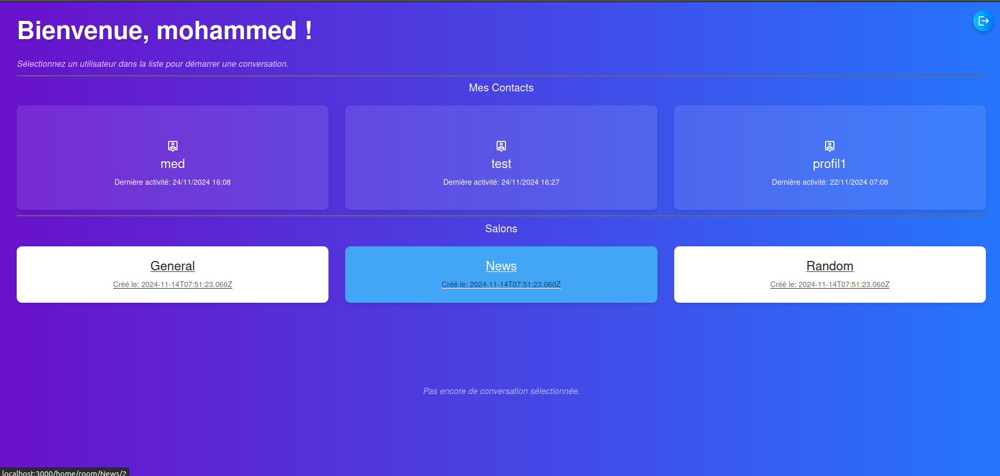
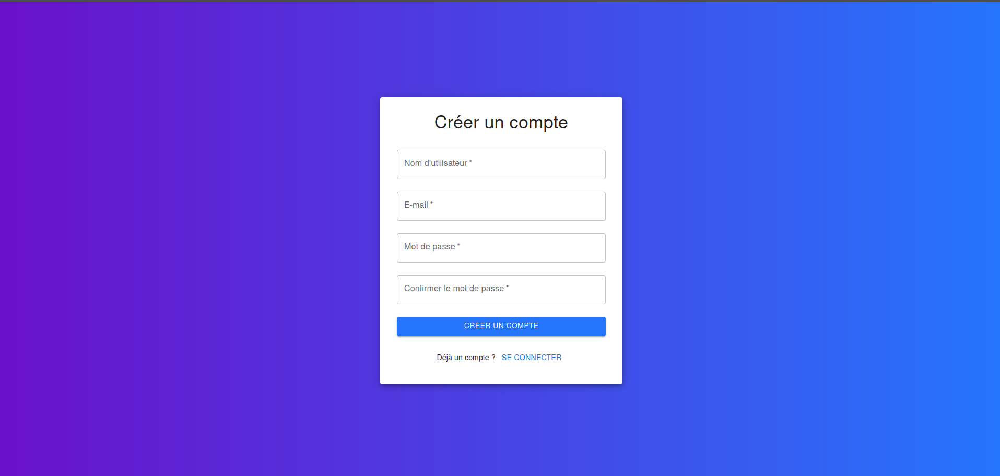
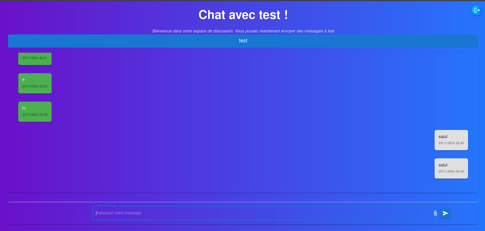

# UBO Relay Chat - Mon Implémentation  

## 🚀 Introduction  
Bienvenue dans ma version personnalisée de l'application UBO Relay Chat, inspirée du TP fourni [demo](https://urc.vercel.app/). Ce projet vise à créer une application de messagerie moderne avec des fonctionnalités avancées telles que la gestion des utilisateurs, les salons de discussion et les notifications push.  



---

## 🛠️ Fonctionnalités Implémentées  

### 1️⃣ Connexion et Authentification  
- Formulaire de connexion avec gestion des tokens de session.  
- Sécurité : Hash des mots de passe et stockage sécurisé des données.  
- Persistance des sessions grâce à `sessionStorage`.  

 (./doc/login.png)

### 2️⃣ Gestion des Utilisateurs  
- Liste des utilisateurs disponibles avec leurs informations publiques (nom, dernière connexion).  
- Fonctionnalité d'inscription avec vérification des doublons.  
- Gestion des tokens et redirection après connexion/inscription réussie.  


### 3️⃣ Messagerie  
- Liste des conversations avec un affichage structuré des messages :  
  - Messages envoyés alignés à droite.  
  - Messages reçus alignés à gauche.  
- **Format Blob pour les messages** : gestion des messages texte, images, et fichiers (détails ci-dessous).  
- Auto-scroll pour voir les derniers messages.  



### 4️⃣ Notifications Push  
- Notifications en temps réel pour les nouveaux messages.  
- Intégration avec Pusher pour gérer les notifications.  
- Enregistrement des notifications via un service worker.  

### 5️⃣ Messagerie en Groupe (Salons)  
- Création et gestion de salons de discussion.  
- Interface dédiée aux groupes avec affichage des membres connectés.  
- Messages groupés enregistrés dans la base de données avec un identifiant de salon spécifique.  

### Format Blob  

## Structure des Messages
Les messages dans cette application sont transmis et stockés en **Blob** pour prendre en charge différents types de contenu (texte, image, GIF).  

### Améliorations UX  
- Utilisation de Material-UI pour un design moderne et réactif.  
- Intégration de React Router pour une navigation fluide entre les pages.  
- Formulaires stylisés et animés.  

## 🧑‍💻 Technologies Utilisées  

- **Frontend** : React, Redux, Material-UI.  
- **Backend** : Node.js, Serverless Functions (Vercel).  
- **Base de Données** : PostgreSQL (via Vercel).  
- **Cache** : Redis (Upstash KV).  
- **Notifications** : Pusher.  
- **Déploiement** : Vercel.  

## 📋 Instructions pour Exécuter  

### Prérequis  
- **Node.js** dernière version ([Télécharger ici](https://nodejs.org)).  
- Compte **Vercel** avec PostgreSQL et Upstash KV configurés.  
- **Pusher** configuré avec les clés API.  

### Étapes  
1. Clonez ce dépôt :  
   ```bash
   git clone https://github.com/Daaouan/urc-main.git
   cd urc-main

   npm install

   vercel env pull .env.development.local

   vercel dev
